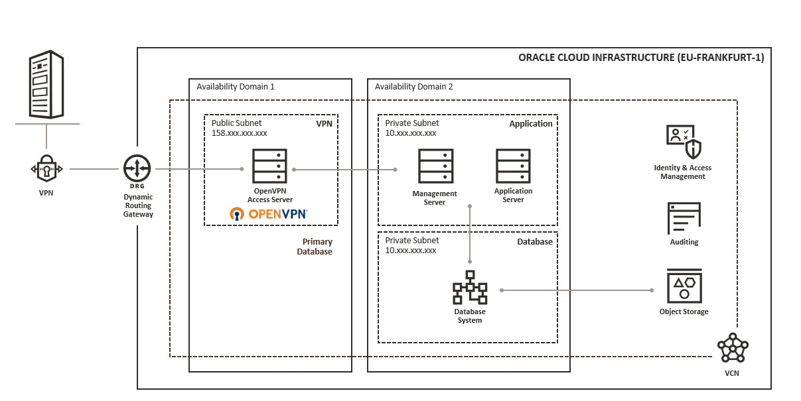

# OpenVPN Setup with Terraform
This terraform collection is creating a public/private subnet setup and an OpenVPN server up and running. 

  

## Components
 * Regional public and private subnet
 * Routing tables and security lists
 * Internet gateway, NAT gateway and service gateway
 * OpenVPN Access Server - Free for 2 Connections
 * Oracle Linux Server in private Subnet
 * (optional) Database system
 * (optional) Management server

# Variables in terraform.tfvars file
Required variables according you Oracle Cloud Infrastructure environment.

| Variable                     | Value                               |
|------------------------------|-------------------------------------|
| compartment_name             | Name of the new compartment         | 
| compartment_master_ocid      | OCID of the master compartment      |
| tenancy_ocid                 | OCID of the tenancy                 |
| compute_shape                | Compute Shape for both VMs          |
| compute_source_id            | Compute Image for the private VM    |
| compute_display_name-01      | Display Name for the private VM     |
| compute_ssh_authorized_keys  | Path and filename of public SSH key |
| vcn_region                   | Region were VCN is created          |

# OpenVPN URL
To get the OVPN client configuration file
 * https://<your_openvpnas_public_ip_here>/?=connect

 Admin console
 * https://<your_openvpnas_public_ip_here>/admin