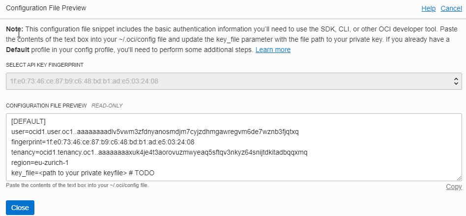

# Machine Setup

Link: https://docs.oracle.com/en-us/iaas/developer-tutorials/tutorials/tf-provider/01-summary.htm

- Oracle Linux
- Terraform installed
- Working directory /home/oci/development/terraform/basics
- OS User _oci_ added
- OCI SDK configuren in /home/oci/.oci
- Compartment added: tf-provisioning / ocid1.compartment.oc1..aaaaaaaapjn7gmanady4vzp2f2ahfwao6vdw6ievze3r4mu6funk6lvrpu4q

```bash
[oci@ol7-devops ~]$ terraform -v
Terraform v0.14.2

Your version of Terraform is out of date! The latest version
is 0.14.3. You can update by downloading from https://www.terraform.io/downloads.html
```
### Created new SSH Key for OS user _oci_ and add it to OCI IAM
https://docs.oracle.com/en-us/iaas/developer-tutorials/tutorials/tf-provider/01-summary.htm

Generate Private Key
```bash
openssl genrsa -out $HOME/.oci/terraform_deployments_29122020.pem 2048
```
Change Permission
```bash
chmod 600 $HOME/.oci/terraform_deployments_29122020.pem
```
Create Public Key
```bash
openssl rsa -pubout -in $HOME/.oci/terraform_deployments_29122020.pem -out $HOME/.oci/terraform_deployments_29122020_public.pem
```
Add Public Key to Account


### Prepare and test Terraform

cd $HOME
mkdir tf-provider
vi provider.tf

```bash
provider "oci" {
  tenancy_ocid = "ocid1.tenancy.oc1..aaaaaaaaxuk4je4t3aorovuzmwyeaq5sftqv3nkyz64snijtdkitadbqqxmq"
  user_ocid = "ocid1.user.oc1..aaaaaaaadlv5vwm3zfdnyanosmdjm7cyjzdhmgawregvm6de7wznb3fjqtxq"
  private_key_path = "/home/oci/.oci/oci_api_key.pem"
  fingerprint = "6a:ce:8e:a7:4a:a1:70:ad:4e:d7:e6:8f:d6:97:55:60"
  region = "eu-zurich-1"
}
```
vi availability-domains.tf
```bash
data "oci_identity_availability_domains" "ads" {
  compartment_id = "ocid1.compartment.oc1..aaaaaaaapjn7gmanady4vzp2f2ahfwao6vdw6ievze3r4mu6funk6lvrpu4q"
}
```


vi outputs.tf
```bash
# Output the "list" of all availability domains.
output "all-availability-domains-in-your-tenancy" {
  value = data.oci_identity_availability_domains.ads.availability_domains
}
```

### Terrform init
```bash
[oci@ol7-devops tf-provider]$ terraform init

Initializing the backend...

Initializing provider plugins...
- Finding latest version of hashicorp/oci...
- Installing hashicorp/oci v4.7.0...
- Installed hashicorp/oci v4.7.0 (signed by HashiCorp)

Terraform has created a lock file .terraform.lock.hcl to record the provider
selections it made above. Include this file in your version control repository
so that Terraform can guarantee to make the same selections by default when
you run "terraform init" in the future.

Terraform has been successfully initialized!

You may now begin working with Terraform. Try running "terraform plan" to see
any changes that are required for your infrastructure. All Terraform commands
should now work.

If you ever set or change modules or backend configuration for Terraform,
rerun this command to reinitialize your working directory. If you forget, other
commands will detect it and remind you to do so if necessary.
```
